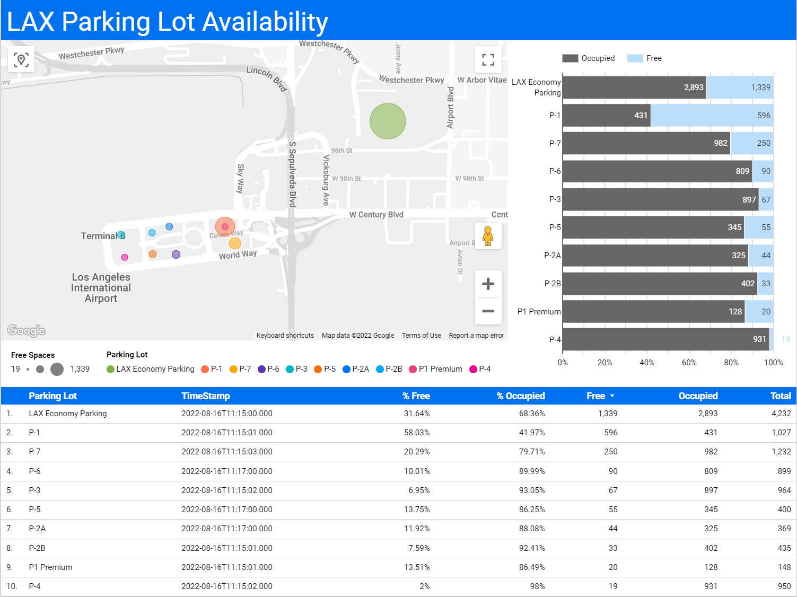

# Return 2Dim Array

API helps format data from various sources into two-dimensional array with field types for schema generation.


## Demo Deplyment
---

A demo deployment can be foud on heroku.

* <https://return-2dim-array.herokuapp.com/docs>

## Example Usage #1
---

### Google Sheets

Google sheets can consume the two-dimensional data directly to sheet.

* <https://docs.google.com/spreadsheets/d/1Vj4xr8E45BVQbE875F-KmeMGY1kKK-5Gakphc0Neey0/edit?usp=sharing>

w/Apps Script Function

```js
function Return2DimArray(api_route, url){
  var payload = {
    "url": url
  }
  var options = {
    'method' : 'post',
    'contentType': 'application/json',
    'payload' : JSON.stringify(payload)
  }
  response = UrlFetchApp.fetch(api_route, options)
  data = JSON.parse(response.getContentText())
  return data["data"]
}
```

### Data Studio

Data Studio can then be used to connect to sheet and visualize data.

* <https://datastudio.google.com/reporting/f8e7591c-07a7-417c-bc78-2910fbc55bc9>




